# Azure Identity Governance & Access Management Platform

## Overview

Identity and Access Management (IAM) is a foundational component of enterprise security, ensuring users receive appropriate access throughout their identity lifecycle while protecting organizational resources through governance, least privilege, and controlled administrative access.

This project demonstrates the design, implementation, and validation of a production-inspired Microsoft Entra Identity Administration and Governance platform that integrates identity administration, identity governance, privileged access management, lifecycle automation, and operational tooling into a unified IAM solution.

The implementation models the identity and governance requirements of a regulated financial services organization and demonstrates how native Microsoft Entra capabilities, combined with Microsoft Graph PowerShell automation, can be used to build a secure, scalable, and operationally manageable identity platform.

The design is aligned with identity security principles from the NIST Cybersecurity Framework (CSF) 2.0 and NIST SP 800-63, together with Microsoft Entra recommendations and established IAM practices.

## Key Features

- Microsoft Entra Identity Administration
- Microsoft Entra Identity Governance
- Lifecycle Workflows for Joiner, Mover, and Leaver processes
- Privileged Identity Management (PIM)
- Conditional Access
- Access Reviews
- Microsoft Graph PowerShell automation
- IAM operational reporting and health checks

## Solution Architecture

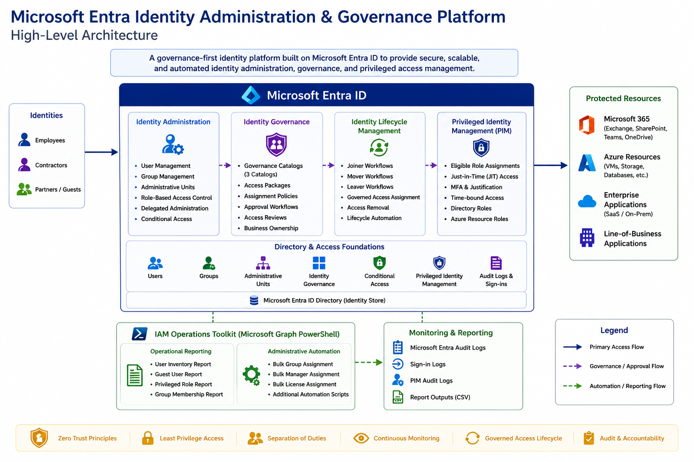

The platform is designed around five integrated platform capabilities that together support the complete identity lifecycle, from identity administration and governed access to privileged access management and operational administration.

| Capability | Description |
|---|---|
| Identity Administration | Establishes the organizational identity foundation through users, groups, Administrative Units, delegated administration, licensing, Conditional Access, and Role-Based Access Control (RBAC). |
| Identity Governance | Provides governed access through catalogs, access packages, approval workflows, assignment policies, and periodic access reviews. |
| Identity Lifecycle Management | Automates Joiner, Mover, and Leaver processes using Microsoft Entra Lifecycle Workflows. |
| Privileged Identity Management | Secures administrative access through eligible role assignments, just-in-time activation, and time-bound privileged access. |
| IAM Operations Toolkit | Extends the platform with operational reporting, health checks, and Microsoft Graph PowerShell automation. |

Each capability builds upon the previous layer, creating a governance-first identity platform that combines administration, automation, and operational management into a cohesive solution.

## Identity Administration

Identity Administration establishes the organizational foundation of the platform by defining how identities, administrative boundaries, and delegated responsibilities are managed across the environment. A structured identity foundation enables governance, lifecycle automation, and privileged access management to operate consistently and securely.

### Implementation Summary

The identity administration layer was implemented to model the organizational structure of a regulated financial services environment and includes:

- Organizational users and manager relationships
- Departmental security groups
- Administrative Units (AUs)
- Delegated administration
- Role-Based Access Control (RBAC)
- Microsoft Entra licensing
- Administrative role assignments
- Conditional Access

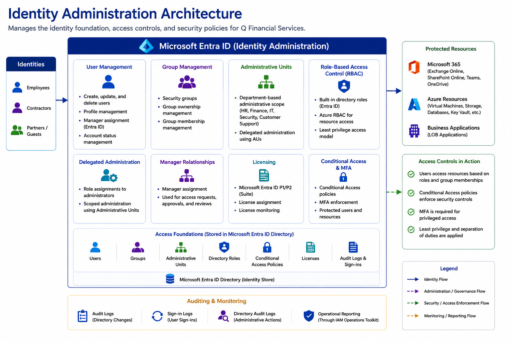

### Implementation

The platform was structured around departmental Administrative Units and security groups to establish clear administrative boundaries while supporting delegated administration. Manager relationships were configured across the organization to support approval workflows, lifecycle automation, and governance processes implemented later in the project.

Administrative responsibilities were delegated using Microsoft Entra built-in roles and Administrative Units, while RBAC was used to assign permissions based on operational responsibilities. Microsoft Entra licensing was configured to enable Identity Governance and Privileged Identity Management capabilities required throughout the platform.

### Conditional Access Policies

The platform implements four foundational Conditional Access policies that strengthen identity security while supporting the overall governance model.

| Policy | Purpose |
|---|---|
| Require MFA for All Users | Strengthens user authentication through Multi-Factor Authentication. |
| Require MFA for Administrators | Protects privileged administrative identities with additional authentication requirements. |
| Require MFA for Privileged Resources | Secures access to privileged management interfaces and resources. |
| Block Legacy Authentication | Prevents legacy authentication protocols from bypassing modern authentication controls. |

### Validation

The identity administration layer was validated by confirming that delegated administration, RBAC assignments, manager relationships, licensing, and Conditional Access operated as designed, providing the required foundation for the governance, lifecycle management, and privileged access capabilities implemented throughout the platform.

The following screenshots provide representative implementation evidence for the Identity Administration configuration.

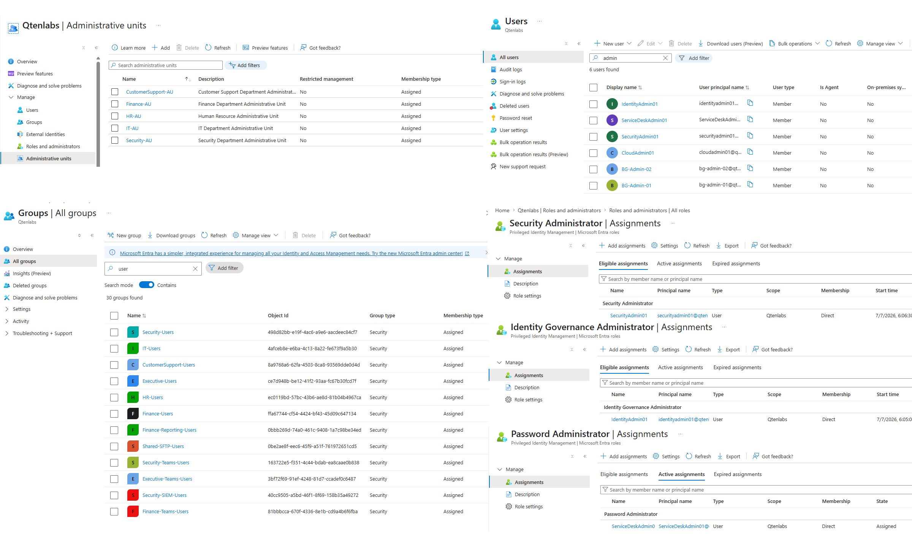

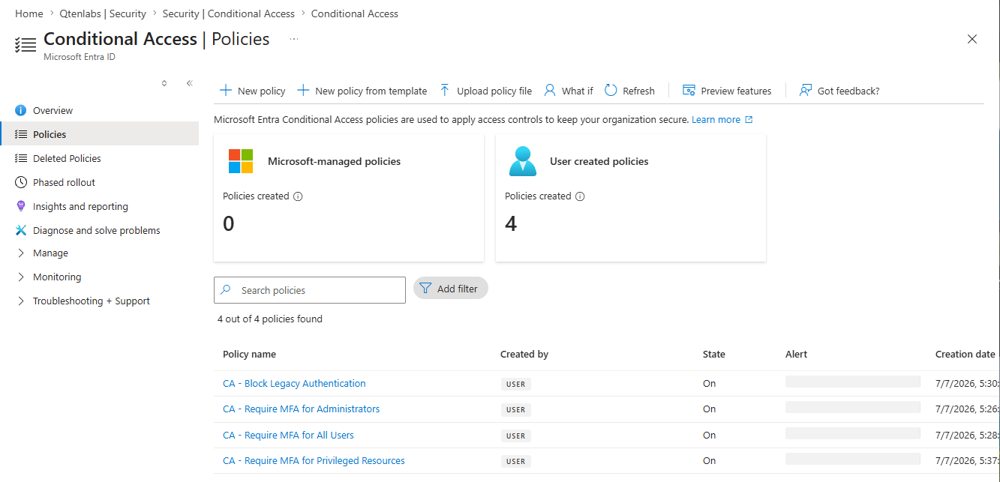

## Identity Governance

Identity Governance extends the platform beyond identity administration by introducing governed access to organizational resources. Rather than assigning permissions directly, access is managed through approval workflows, policy-driven assignments, periodic access reviews, and business ownership, ensuring access remains controlled throughout its lifecycle.

### Implementation Summary

The Identity Governance implementation includes:

- Three governance catalogs
- Department Standard Access Packages
- Business Resource Access Packages
- Privileged Access Packages
- Multi-stage approval workflows
- Assignment expiration policies
- Periodic access reviews
- Business ownership and governance delegation

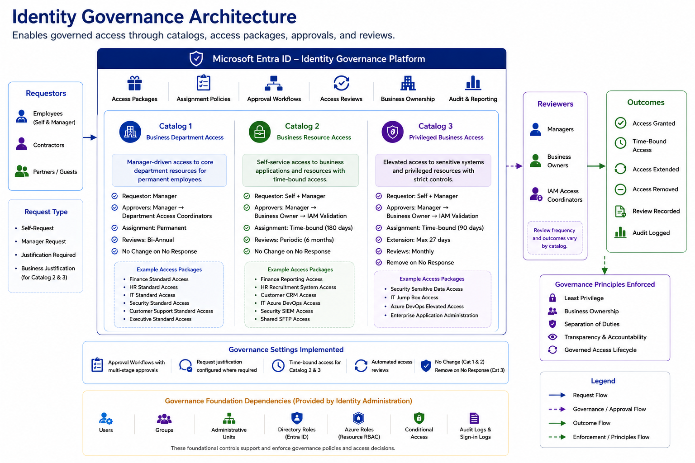

### Implementation

The governance model was designed around three distinct catalogs, each serving a different access management purpose:

- **Business Department Access** provides governed baseline access for departmental users.
- **Business Resource Access** manages access to shared business applications and resources through self-service requests and approval workflows.
- **Privileged Business Access** governs elevated and sensitive access using shorter assignment durations, stricter approval requirements, and more frequent reviews.

Each catalog uses access packages, assignment policies, approval workflows, expiration settings, and access reviews appropriate to the level of risk associated with the resources it manages.

### Validation

The governance implementation was validated by confirming that access package requests, approval workflows, assignment policies, expiration settings, and access reviews operated as designed across each governance catalog.

The following screenshot provides representative implementation evidence for the Identity Governance implementation.

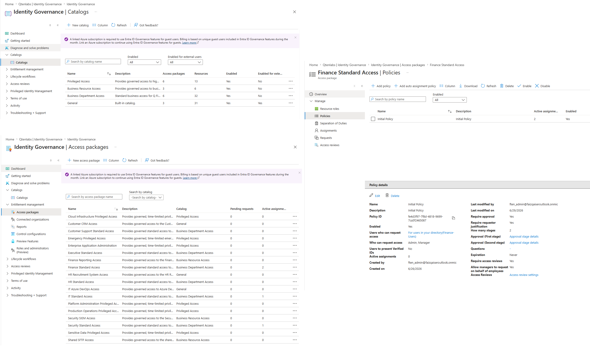

## Identity Lifecycle Management

Identity Lifecycle Management automates identity changes throughout the employee lifecycle. Department-specific Joiner, Mover, and Leaver workflows were implemented using native Microsoft Entra Lifecycle Workflows to support governed provisioning, access transitions, and deprovisioning.

### Implementation Summary

The lifecycle implementation includes:

- Department-based Joiner workflows
- Department transfer Mover workflows
- Organization-wide Leaver processing
- Access Package assignment and removal
- Group membership updates
- Token revocation
- Account access controls
- License removal where supported

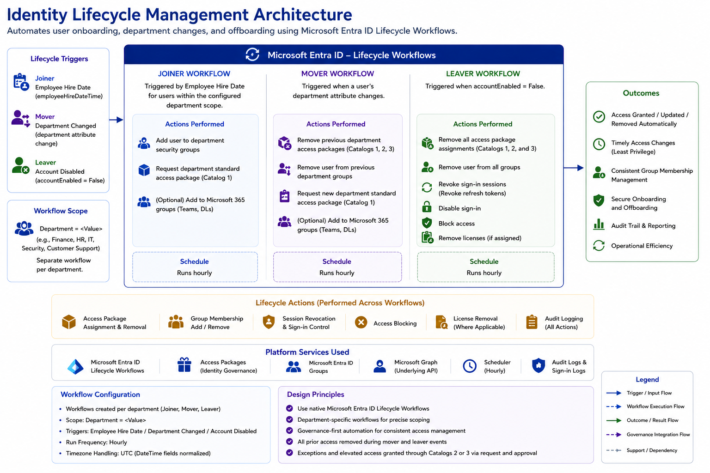

### Implementation

Joiner workflows assign governed department access when eligible users enter the organization or move into a supported department. Mover workflows remove previous department access and request the appropriate destination access package when a department change is detected.

The Leaver workflow removes governed access and group memberships, revokes refresh tokens, blocks access, disables sign-in, and removes licenses where supported. Native workflow capabilities were used where they satisfied the business requirements, avoiding unnecessary external orchestration.

### Validation

Lifecycle automation was validated through controlled Joiner, Mover, and Leaver tests. Workflow history and audit records were reviewed to confirm access assignment, department transfer processing, prior-access removal, and offboarding controls.

The following screenshot provides representative implementation evidence for the Lifecycle Workflows configuration and execution history.

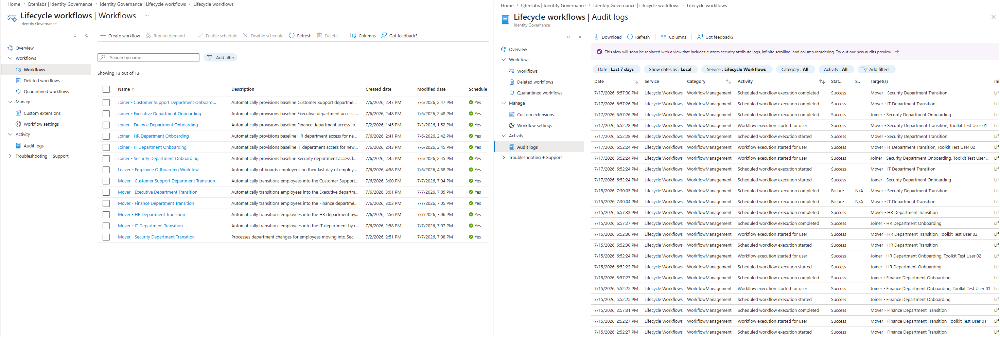

## Privileged Identity Management

Privileged Identity Management (PIM) secures administrative access by replacing permanent privileged assignments with eligible, just-in-time access. Administrative roles are activated only when required, reducing standing privileges while providing greater control, accountability, and auditability.

### Implementation Summary

The privileged access implementation includes:

- Microsoft Entra PIM
- Eligible administrative role assignments
- Just-in-time role activation
- Multi-Factor Authentication
- Activation justification
- Time-bound privileged access
- Azure resource role management

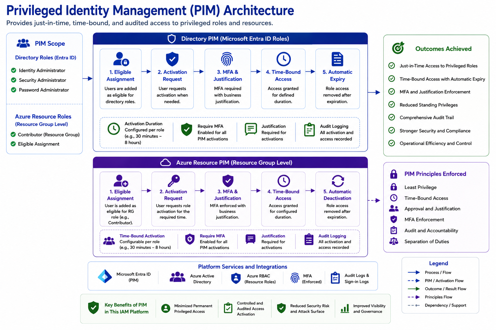

### Implementation

The platform implements Microsoft Entra PIM for both directory roles and Azure resource roles. Administrative access is granted through eligible role assignments, requiring users to activate privileges when administrative tasks are performed.

Activation policies were configured to require Multi-Factor Authentication, business justification, and time-limited access, ensuring privileged permissions are granted only for the duration required to complete administrative activities.

### Validation

Privileged access was validated by activating eligible roles, confirming policy enforcement, verifying time-bound access, and testing administrative permissions during the activation period.

The following screenshot provides representative implementation evidence for eligible assignments, activation controls, and Azure resource PIM.

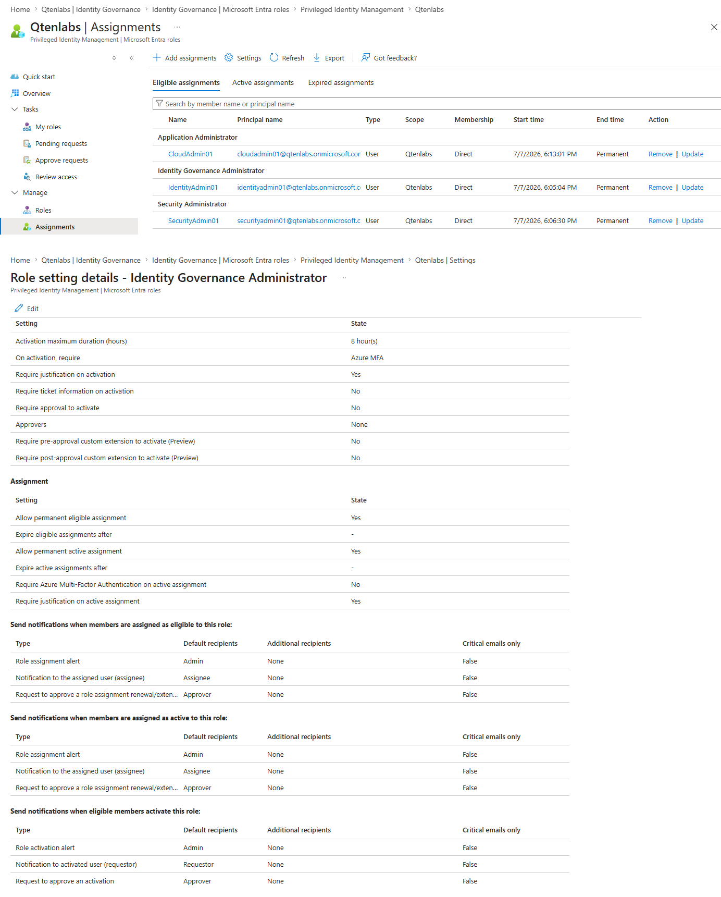

## Access Reviews

Access Reviews provide recurring validation of governed access and help ensure that assignments remain appropriate over time. Review frequency, ownership, and default decisions were aligned with the sensitivity and operational purpose of each governance catalog.

### Implementation Summary

- **Business Department Access:** Bi-annual review by the user's manager, with no change applied when no response is received.
- **Business Resource Access:** Quarterly review by the business owner, with no change applied when no response is received.
- **Privileged Business Access:** Monthly review by the IT Access Coordinator, with access removed when no response is received.

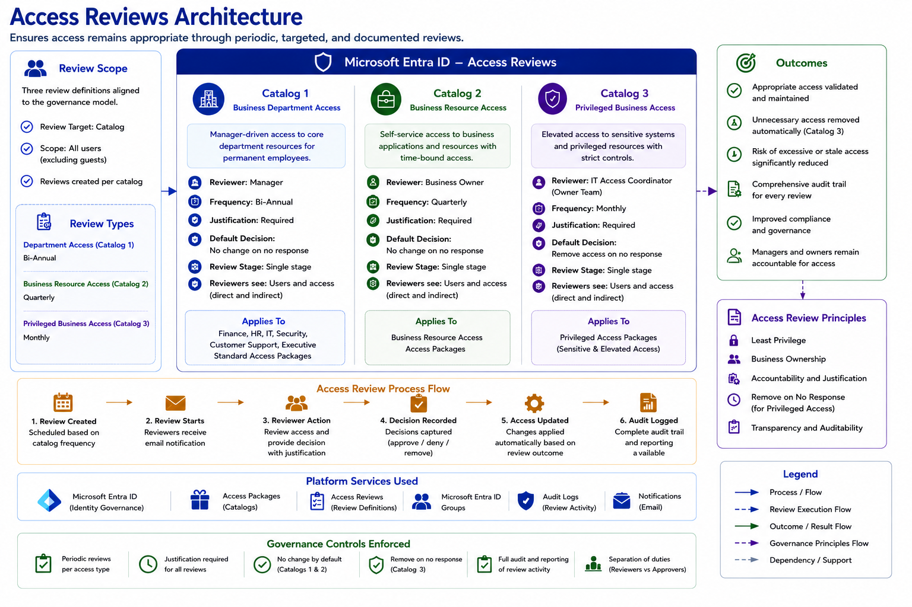

### Validation

Access Review configurations were validated across all three governance catalogs by confirming the selected reviewers, review frequencies, justification requirements, and default outcomes.

The following screenshot provides representative implementation evidence for the Access Review configuration.

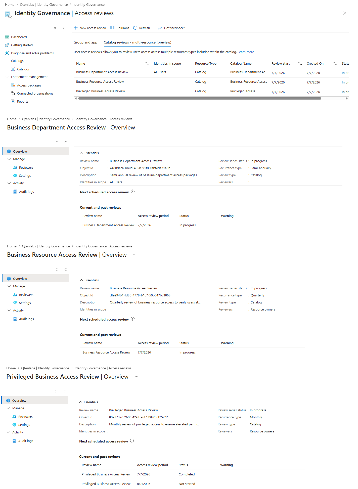

## IAM Operations Toolkit

The IAM Operations Toolkit extends the platform beyond native Microsoft Entra administration by providing operational reporting and administrative automation using Microsoft Graph PowerShell. The toolkit was designed to support common IAM operational tasks, improve administrative efficiency, and provide greater visibility into the identity environment.

### Implementation Summary

#### Operational Reporting

- User Inventory Report
- Guest User Report
- Privileged Role Report
- Group Membership Report
- Empty Groups Health Check

#### Administrative Automation

- Bulk Group Assignment
- Bulk Manager Assignment
- Bulk License Assignment
- Bulk Onboarding
- Department Transfer
- Bulk Offboarding

### Implementation

The toolkit was developed using Microsoft Graph PowerShell to complement the governance capabilities of the platform with operational reporting and repeatable administrative automation.

Reporting scripts provide visibility into users, guests, groups, privileged roles, and identity health. Related reporting requirements were consolidated where appropriate to reduce duplication and keep the toolkit operationally focused.

Automation scripts support common IAM administrative activities through standardized, CSV-driven workflows that improve consistency while reducing repetitive manual administration. Each automation supports safe validation through `-WhatIf`, controlled execution, and result reporting.

The scripts are organized into separate directories:

- [`Scripts/Reporting`](Scripts/Reporting/)
- [`Scripts/Automation`](Scripts/Automation/)

### Validation

The toolkit was validated through controlled execution of every reporting and automation script. Reporting outputs were verified against the Microsoft Entra environment, while automation workflows were tested using `-WhatIf`, controlled live execution, post-execution validation, and rollback where appropriate.

Representative PowerShell execution screenshots demonstrate the successful operation of both reporting and administrative automation modules.

**Reporting execution:** The User Inventory report retrieves Microsoft Entra user, department, manager, licensing, and account information and exports the results to CSV for operational review.

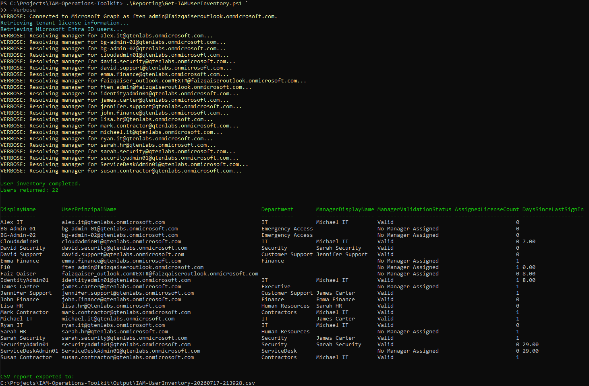

**Automation execution:** The Bulk Onboarding workflow processes standardized CSV input, creates users, applies identity attributes and manager assignments, and exports an execution report for validation.

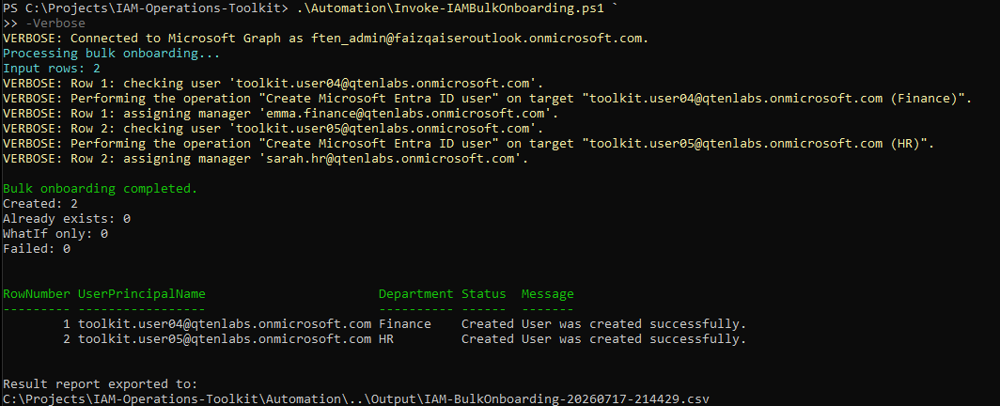

## Security Alignment

The platform was designed using security and identity governance principles aligned with the NIST Cybersecurity Framework (CSF) 2.0 and NIST SP 800-63 Digital Identity Guidelines. These frameworks influenced the architecture and governance model by emphasizing identity lifecycle management, least privilege, separation of duties, governed access, and controlled privileged administration.

Rather than implementing security controls in isolation, these principles are reflected throughout Identity Administration, Conditional Access, Identity Governance, Lifecycle Management, Privileged Identity Management, Access Reviews, and the IAM Operations Toolkit.

This project demonstrates architectural alignment with recognized security and identity governance practices. It does not represent a formally assessed or certified compliance implementation.

## Technology Stack

| Category | Technology |
|---|---|
| Identity Platform | Microsoft Entra ID |
| Identity Governance | Microsoft Entra Identity Governance |
| Privileged Access | Microsoft Entra Privileged Identity Management |
| Identity Security | Microsoft Entra Conditional Access |
| Automation | Microsoft Graph PowerShell SDK |
| Scripting | PowerShell |
| Reporting | CSV and Microsoft Graph |
| Version Control | Git and GitHub |

## Production Enhancements

This project establishes a production-inspired identity administration and governance platform that can be extended as organizational requirements evolve. Potential production enhancements include:

- Identity federation using SAML and OpenID Connect (OIDC) *(for example, partner organizations and external identity providers)*
- SCIM-based identity provisioning *(for example, SaaS applications and enterprise platforms)*
- HR system integration for event-driven lifecycle management *(for example, Workday or SAP SuccessFactors)*
- Advanced orchestration using Azure Logic Apps *(for example, external system integration and custom workflow processing)*
- Governance dashboards and operational analytics *(for example, Power BI, Azure Monitor, and Log Analytics)*
- Expanded operational reporting and administrative automation *(for example, service ticket integration, scheduled reporting, and exception remediation)*

## Architecture Decisions

The platform architecture was guided by a series of Architecture Decision Records (ADRs) that document the key design decisions made throughout the planning and implementation of the solution.

These records explain the architectural reasoning behind the selected approaches, their impact on the platform, and how each decision is reflected within the implementation.

The complete ADR collection is available in [`Documentation/Architecture-Decisions`](Documentation/Architecture-Decisions/).

The current ADRs include:

- [ADR-001 - Governance-First Identity Architecture](Documentation/Architecture-Decisions/ADR-001-Governance-First-Identity-Architecture.md)
- [ADR-002 - Native Lifecycle Workflows](Documentation/Architecture-Decisions/ADR-002-Native-Lifecycle-Workflows.md)
- [ADR-003 - Three-Tier Governance Model](Documentation/Architecture-Decisions/ADR-003-Three-Tier-Governance-Model.md)
- [ADR-004 - Risk-Based Access Review Strategy](Documentation/Architecture-Decisions/ADR-004-Risk-Based-Access-Review-Strategy.md)
- [ADR-005 - Just-in-Time Privileged Administration](Documentation/Architecture-Decisions/ADR-005-Just-in-Time-Privileged-Administration.md)
- [ADR-006 - Security Framework Alignment](Documentation/Architecture-Decisions/ADR-006-Security-Framework-Alignment.md)
- [ADR-007 - IAM Operations Toolkit Scope](Documentation/Architecture-Decisions/ADR-007-IAM-Operations-Toolkit-Scope.md)
